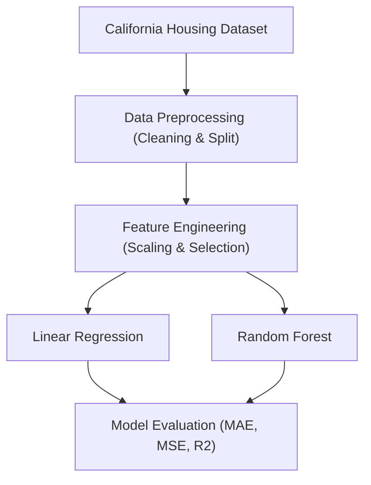

Project Overview

The aim of this project is to explore and compare the performance of two different regression algorithms on the California Housing dataset:
-Linear Regression
-Random Forest Regression

Both models are trained to predict median house values using features such as median income, house age, average rooms, and others.
This project can serve as a starting point for anyone looking to understand regression modeling on real-world housing data.

Features
-Data preprocessing and exploratory analysis
-Implementation of Linear Regression
-Implementation of Random Forest Regression
-Model evaluation using common metrics
-Clear project structure with dataset, models, and scripts

Getting Started

Prerequisites

Make sure you have Python installed (version 3.7+ recommended). You also need pip for installing dependencies.

Installation

Clone the repository:

1.git clone https://github.com/Openknot7/Housing_model.git
cd Housing_model

2.(Optional) Create and activate a virtual environment:
  python -m venv venv
  source venv/bin/activate   # On Windows: venv\Scripts\activate

3.Install dependencies:
  pip install -r requirements.txt

Usage

1.Ensure the dataset is located in the datasets/ folder.
2.Run the main training script:
  python fixed_model.py

Evaluate or compare results for each model. Modify or extend scripts as needed.

Models
i) Linear Regression
   -A baseline model that fits a linear relationship between features and housing prices.

ii) Random Forest Regression
    -An ensemble learning model that fits multiple decision trees and averages results to improve prediction accuracy.

Project Architecture
| Step                              | Description                                                     |
| --------------------------------- | --------------------------------------------------------------- |
| **1. California Housing Dataset** | Raw housing data from the California dataset.                   |
| **2. Data Preprocessing**         | Cleaning, handling missing values, and train/test split.        |
| **3. Feature Engineering**        | Scaling, encoding categorical variables, and feature selection. |
| **4a. Linear Regression**         | Train a simple linear regression model.                         |
| **4b. Random Forest Regression**  | Train a Random Forest ensemble tree model.                      |
| **5. Model Evaluation**           | Evaluate models using **MAE, MSE, and R² Score**.               |

## Project Architecture

### What to include in the notebook
- Dataset loading
- Basic EDA (head, describe)
- Model comparison

#### Typical Model Results

These example results are based on standard implementations of the California Housing dataset:
| Model                    | MAE (USD) | MSE (USD²)    | R² Score |
| ------------------------ | --------- | ------------- | -------- |
| Linear Regression        | 52,138    | 4,922,016,476 | 0.645    |
| Random Forest Regression | 30,429    | 2,280,072,324 | 0.836    |

*Actual results may vary depending on preprocessing, train/test split, and hyperparameter tuning. But, these are my obtained scores on the basis of my prediction model*

“Built and evaluated regression models (Linear & Random Forest) on the California Housing dataset, including preprocessing, feature engineering, and performance comparison using MAE, MSE, and R².”

